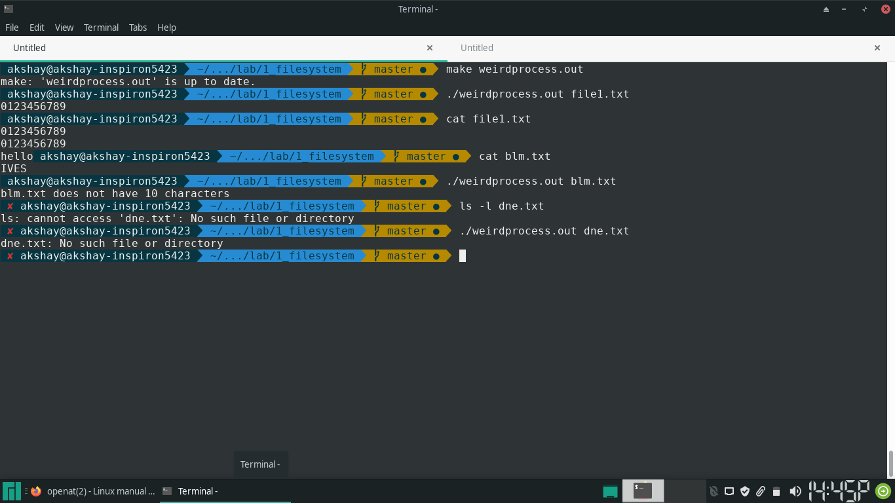
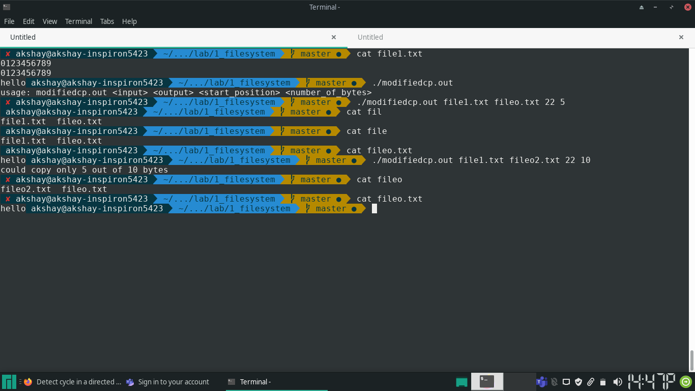

### 1. Assume that you have to read 10 characters from the beginning of an existing file and then to write “hello” to the end of the file. Write a program to achieve this only using read and write functions. Donot use lseek function.

```{.c}

#include <unistd.h>
#include <fcntl.h>
#include <stdio.h>
#include <errno.h>
#include <string.h>

#define BUFSIZE 512
#define FIRSTCHARS 10

int main(int argc, char *argv[]) {
		if (argc != 2) {
				fprintf(stderr, "usage: weirdprocess <filename>\n");
				return EINVAL;
		}

		int fp, count;
		char smallbuf[FIRSTCHARS + 1];

		if ((fp = open(argv[1], O_RDWR)) == -1) {
				perror(argv[1]);
				return errno;
		}

		/* read first 10 characters from the file */
		if (read(fp, smallbuf, FIRSTCHARS) != FIRSTCHARS) {
				fprintf(stderr, "%s does not have %d characters\n", argv[1], FIRSTCHARS);
				return EINVAL;
		}

		smallbuf[FIRSTCHARS] = '\n';

		/* write first 10 characters to stdout */
		if ((count = write(0, smallbuf, FIRSTCHARS + 1)) != FIRSTCHARS + 1) {
				if (count == -1) {
						perror(argv[1]);
						return errno;
				}
				else {
						fprintf(stderr, "could not write first %d chars to stdout\n", 
										FIRSTCHARS + 1);
						return EINVAL;
				}
		}
		close(fp);

		if ((fp = open(argv[1], O_APPEND | O_WRONLY)) == -1) {
				perror(argv[1]);
				return errno;
		}

		// assert: we have reached the end of the given file

		strcpy(smallbuf, "hello");

		/* write "hello" at the end of the file */
		if ((count = write(fp, smallbuf, strlen(smallbuf))) != strlen(smallbuf)) {
				if (count == -1) {
						perror(argv[1]);
						return errno;
				}
				else {
						fprintf(stderr, "could not write %s at the end of file %s\n", 
										smallbuf, argv[1]);
						return EINVAL;
				}
		}

		if (close(fp)) {
				perror(argv[1]);
				return errno;
		}

		return 0;
}

```

#### Output



### 2. Write a program to create a function cp\_modified(source\_filename, target\_filename, start\_position, number\_of\_bytes),  which copies the number\_of\_bytes of contents of input file source\_filename from the start\_position to the target\_filename.

```{.c}

#include <unistd.h>
#include <fcntl.h>
#include <stdio.h>
#include <errno.h>
#include <string.h>
#include <stdlib.h>
#include <sys/types.h>
#include <regex.h>

#define BUFSIZE 4096
#define FIRSTCHARS 10

/* 
 * copies the number_of_bytes of contents of input file source_filename from the
 * start_position to the target_filename
 * RETURN VALUE:
 * In case of error from system , returns -1, without changing errno- this is
 * done for avoding printing of errors within the function 
 * Otherwise, returns the number of bytes written to destination file
 * */
#define MIN(a, b) ((a) < (b) ? (a) : (b))
int cp_modified(char *source_filename,
				char *target_filename,
				int start_position,
				int number_of_bytes) {

		int fi, fo;
		int count, ret;
		int totalcount= 0;
		char buf[BUFSIZE];

		if ((fi = open(source_filename, O_RDONLY)) == -1) {
				ret = fi;
				goto noclose;
		}

		if ((fo = open(target_filename, 
			O_CREAT | O_WRONLY | O_TRUNC, S_IRUSR | S_IWUSR)) == -1) {
				ret = -1;
				goto firstfilecleanup;
		}

		if ((ret = lseek(fi, start_position, SEEK_SET)) == -1)
				goto fullcleanup;

		while((count = 
			  read(fi, buf, MIN(number_of_bytes - totalcount, BUFSIZE))) 
			  				== BUFSIZE) {
				if ((ret = write(fo, buf, count)) == -1) 
						goto fullcleanup;
				totalcount += count;
		}

		if (count == -1) {
				goto fullcleanup;
		}
		
		if ((ret = write(fo, buf, count)) != count)
				if (ret == -1)
						goto fullcleanup;

		close(fi);
		close(fo);

		totalcount += ret;

		return totalcount;

fullcleanup:
		close(fo);
firstfilecleanup:
		close(fi);
noclose:
		return ret;
}


#define POSITIVEINT_REG "^\\+?[0-9]+$"
int main(int argc, char *argv[]) {
		if (argc != 5) {
				fprintf(stderr, "usage: modifiedcp.out <input> <output> <start_position> 
									<number_of_bytes>\n");
				return EINVAL;
		}

		int start, n_bytes;
		regex_t positiveint;

		regcomp(&positiveint, POSITIVEINT_REG, REG_EXTENDED | REG_NOSUB);

		if (regexec(&positiveint, argv[3], 0, NULL, 0) || 
				regexec(&positiveint, argv[4], 0, NULL, 0)) {
				fprintf(stderr, "%s -> %s should be positive integers\n", 
									argv[1], argv[2]);
				regfree(&positiveint);
				return EINVAL;
		}
		regfree(&positiveint);

		start = atoi(argv[3]);
		n_bytes = atoi(argv[4]);

		int ret;
		if ((ret = cp_modified(argv[1], argv[2], start, n_bytes)) != n_bytes) {
				if (ret == -1) {
						fprintf(stderr, "%s, %s", argv[1], argv[2]);
						perror("");
						return errno;
				}
				else {
						fprintf(stderr, "could copy only %d out of %d bytes\n", 
										ret, n_bytes);
						return 1;
				}
		}

		return 0;
}

```

#### Output



