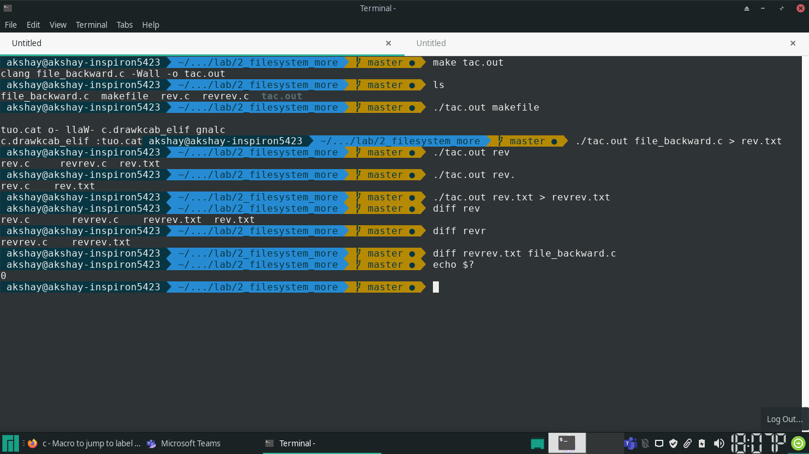
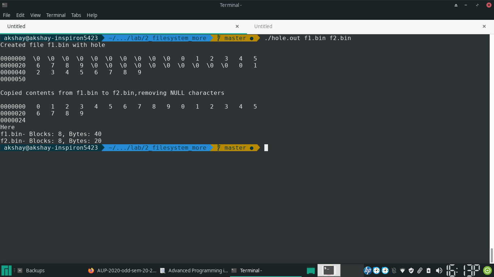
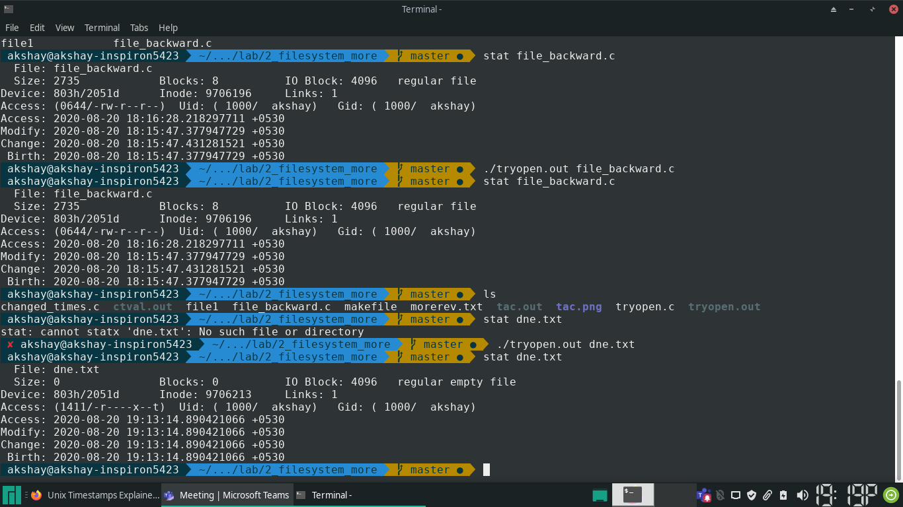

### Q1 
Take a file name as command line argument and print the file in backwards.

```{.c}

#include <sys/types.h>
#include <sys/stat.h>
#include <fcntl.h>
#include <unistd.h>
#include <errno.h>
#include <stdio.h>
#include <string.h>

void str_reverse(char *buf, int len) {
		int left, right;
		left = 0;
		right = len - 1;
		char temp;
		while (left < right) {
				temp = buf[left];
				buf[left] = buf[right];
				buf[right] = temp;
				++left;
				--right;
		}
}

#define BUFSIZE 4096

int main(int argc, char *argv[]) {
		if (argc != 2) {
				printf("usage: ./tac.out <filename>\n");
				return EINVAL;
		}

		int fp, bytes, bytes_prev, bytes_read;
		char buf[BUFSIZE];


		/* try to open file */
		if ((fp = open(argv[1], O_RDONLY)) == -1) {
				perror(argv[1]);
				return errno;
		}

		/* assert: file exist and fd has a descriptor 
		 * which points to file */

		/* go to end of file */
		if ((bytes = lseek(fp, 0, SEEK_END)) == -1) {
				perror("cannot lseek to end of file");
				goto graceful_exit;
		}
		/* printf("Size of file = %d\n", bytes); */

		bytes_prev = bytes;
		/* printf("bytes read = %d\n", bytes_prev); */
		while ((bytes = lseek(fp, -BUFSIZE, SEEK_CUR)) != -1) {
				/* while we *can* move BUFSIZE bytes backward */
				bytes_prev = bytes;

				if ((bytes_read = read(fp, buf, BUFSIZE)) != BUFSIZE) {
						perror("read");
						goto graceful_exit;
				}
				/* assert: read BUFSIZE bytes into buffer */

				str_reverse(buf, BUFSIZE);
				/* reverse the buffer */

				if (write(1, buf, BUFSIZE) != BUFSIZE) {
						perror("unable to write chunk to stdout");
						goto graceful_exit;
				}
				/* wrote the reverse of the buffer to stdout */

				if (lseek(fp, -BUFSIZE, SEEK_CUR) != bytes_prev) {
						perror("unable to seek to previous position");
						goto graceful_exit;
				}

				/* assert: at the end of the next block to be read */
		}

		/* assert: cannot lseek BUFSIZE bytes backward, this means that there
		 * are less than BUFSIZE bytes left OR we have read the last chunk */

		/* assert: bytes_prev contains the offset of the last chunk that was
		 * *read* */

		if (errno != EINVAL) {
				/* assert: error is not due to going before 0 */
				perror("wrong error when lseeking to negative offset");
				goto graceful_exit;
		}

		if (lseek(fp, 0, SEEK_SET) != 0) {
				perror("cannot seek to beginning of file");
				goto graceful_exit;
		}

		/* assert: we are at the beginning of file */

		if (read(fp, buf, bytes_prev) != bytes_prev) {
				/* printf("bytes_read = %d\n", bytes_prev); */
				perror("unable to read last chunk");
				goto graceful_exit;
		}

		str_reverse(buf, bytes_prev);
		if (write(1, buf, bytes_prev) != bytes_prev) {
				perror("unable to write last chunk");
				goto graceful_exit;
		}

		close(fp);
		return 0;

graceful_exit:
		close(fp);
		return errno;
}

```



---

### Q2 

> Write a program to create a file with a hole: write any 10 bytes at an
> offset of 10 and another 10 bytes at an offset of 30. Using “system”
> function, invoke “od” command and view the contents. Later copy the contents
> of the file to another file without writing the bytes of 0. Once again
> verify the contents by invoking “system” with “od”.  What is the size of the
> file with hole and the new file found using lstat?

```{.c}

#include <sys/types.h>
#include <sys/stat.h>
#include <fcntl.h>
#include <unistd.h>
#include <errno.h>
#include <stdio.h>
#include <stdlib.h>

#define TEXT "0123456789"

		int filter(char *dest, char *src, int n) {
				int l1, l2;
				l1 = l2 = 0;
				while (l1 < n) {
						if (src[l1]) {
								dest[l2++] = src[l1];
						}
						l1++;
				}
				return l2;
		}


int main(int argc, char *argv[]) {
		int fi, fo;
		char buf[256];
		char buf2[256];
		int bytes;

		if (argc != 3) {
				fprintf(stderr, "usage: ./hole.out <file1> <file2>\n");
				return EINVAL;
		}

		if ((fo = open(argv[1], 
										O_WRONLY | O_CREAT | O_TRUNC, 
										S_IRUSR | S_IWUSR)) == -1) {

				perror(argv[1]);
				return errno;
		}

		if (lseek(fo, 10, SEEK_SET) == -1) {
				perror("lseek 10");
				close(fo);
				return errno;
		}

		if (write(fo, TEXT, 10) != 10) {
				perror("write [10, 20)");
				close(fo);
				return errno;
		}

		if (lseek(fo, 30, SEEK_SET) == -1) {
				perror("lseek 30");
				close(fo);
				return errno;
		}

		if (write(fo, TEXT, 10) == -1) {
				perror("write [30, 40)");
				close(fo);
				return errno;
		}

		printf("Created file %s with hole\n\n", argv[1]);

		close(fo);

		sprintf(buf, "od -c %s", argv[1]);

		if (system(buf) == -1) {
				perror(buf);
				return errno;
		}

		if ((fi = open(argv[1], O_RDONLY)) == -1) {
				perror(argv[1]);
				return errno;
		}

		if ((fo = open(argv[2], 
										O_WRONLY | O_CREAT | O_TRUNC, 
										S_IRUSR | S_IWUSR)) == -1) {
				perror(argv[2]);
				close(fi);
				return errno;
		}

		printf("\nCopied contents from %s to %s,"
						"removing NULL characters\n\n", 
						argv[1], argv[2]);

		int len;
		while((bytes = read(fi, buf, 256)) == 256) {
				len = filter(buf2, buf, 256);
				if (write(fo, buf2, len) != len) {
						perror("write failed");
						close(fi);
						close(fo);
						return errno;
				}
				return 0;
		}

		len = filter(buf2, buf, bytes);
		if (write(fo, buf2, len) != len) {
				perror("write failed");
				close(fi);
				close(fo);
				return errno;
		}

		close(fi);
		close(fo);

		sprintf(buf, "od -c %s", argv[2]);

		if (system(buf) == -1) {
				perror(buf);
				return errno;
		}

		struct stat f1, f2;

		printf("Here\n");

		if (lstat(argv[1], &f1) == -1) {
				sprintf(buf, "lstat %s", argv[1]);
				perror(buf);
				return errno;
		}

		if (lstat(argv[2], &f2) == -1) {
				sprintf(buf, "lstat %s", argv[2]);
				perror(buf);
				return errno;
		}

		printf("%s- Blocks: %ld, Bytes: %ld\n", argv[1], f1.st_blocks, f1.st_size);

		printf("%s- Blocks: %ld, Bytes: %ld\n", argv[2], f2.st_blocks, f2.st_size);

		return 0;
}


```

### Ouput



### Explanation
- The bytes in the hole, when read, show NULL.
- The size of the file with the hole is 40 bytes, while when non-null characters
  are copied to another file, the size of the new file is 20 bytes
- Because there is no way to differentiate between NULL bytes in the hole and
  NULL bytes which might be present in the file as data, data bytes might be
  skipped when copying only the non-nulls to the new file

---

### Q3 

> Which are time values gets modified by the successful execution of the
> function? Assume two cases: 
> 	open(“file1”, O_WRONLY|O_CREAT, 777) ;
> 
> 	1. File already existing
> 	2. New file is created


The following program was used for carrying out the procedure

```{.c}

#include <sys/types.h>
#include <fcntl.h>
#include <unistd.h>
#include <errno.h>
#include <stdio.h>

		int main(int argc, char *argv[]) {
				int fp;

				if (argc != 2) {
						fprintf(stderr, "usage: ./tryopen.out <filename");
						return EINVAL;
				}

				if ((fp = open(argv[1], O_WRONLY | O_CREAT, 777)) == -1) {
						perror(argv[1]);
						return errno;
				}

				close(fp);

				return 0;
		}

```
### Existing file
1. Existing file times were examined using "stat" command
2. The program was run with the name of the existing file as argument
3. The file times were examined again using the stat command
4. The file times in (1) and (3) were found to be the same

### New file
1. Running stat with name of non existing file gave error
2. Program was run with new file name, creating an empty file
3. The file times were examined using the stat command
4. All the three times had the same value

### Explanation

1. When the file already exists, **none of the time values get affected**. This
has been verified by calling the function and viewing the modified values
		before and after stat.
- This is because *the file is not modified* (no write happens)
		- The file is not *accessed as it has been opened in write mode*.
		- The file is not changed, because data in the inode has not been changed.

2. When the new file is created, **all the time values are affected**. All three
fields are set to the same time.


