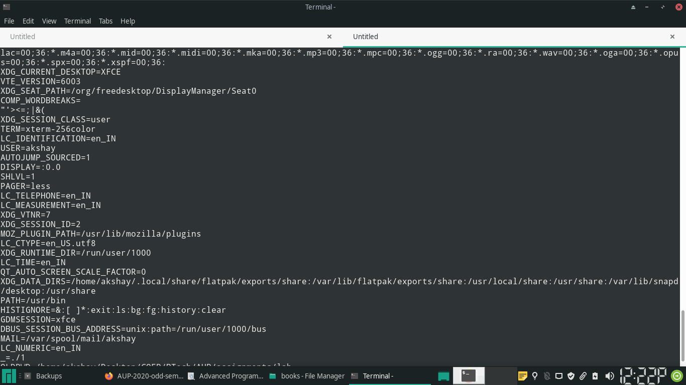
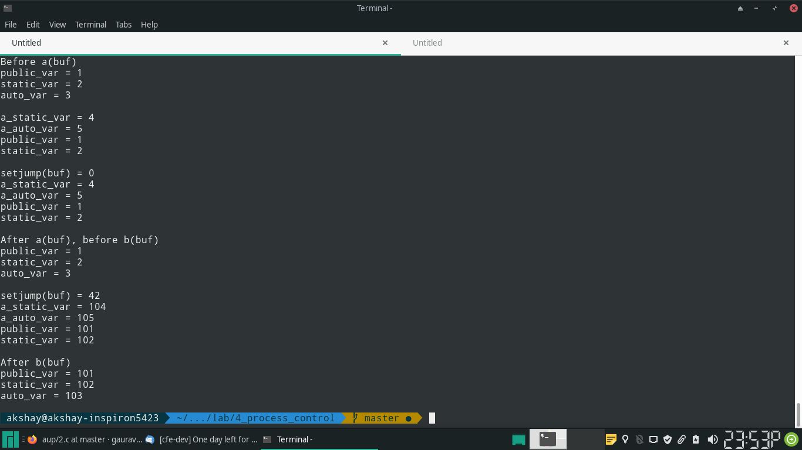
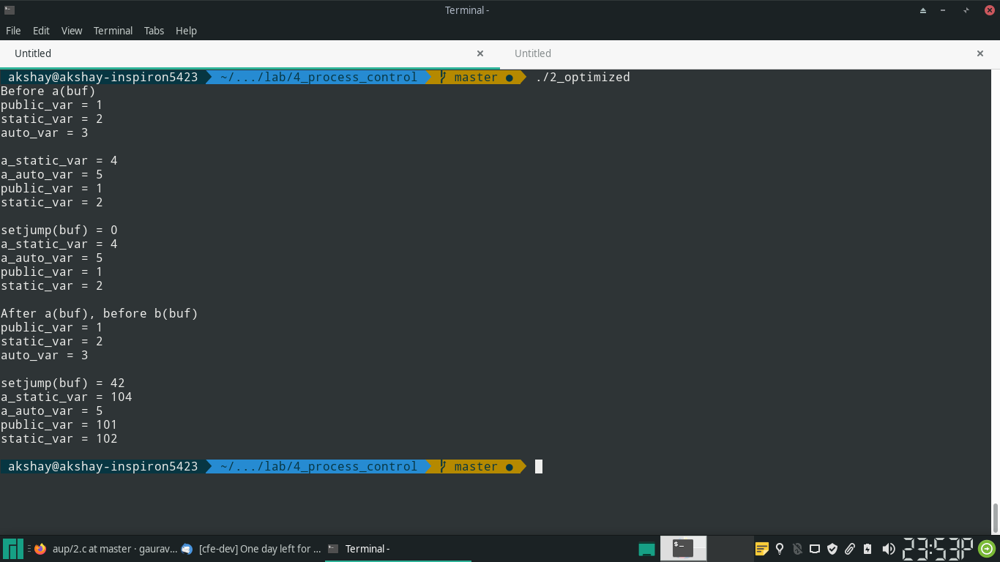
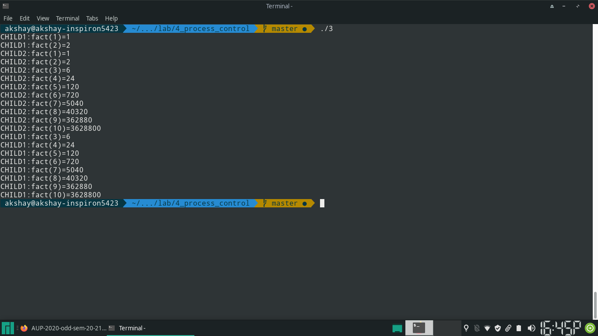

## Q1

> Write a program to print all existing environment variables with their values.
> Later input a new variable and its value and add to the environment list. Also
> change the value of PATH to "/usr/bin". Once again call to print the
> environment list.
>
> Then in the command line, print the environment list. What is your
> observation?

## Code

\small
```{.c .numberLines startFrom="1"}

#include <stdio.h>
#include <stdlib.h>
#include <errno.h>

void printenv(char **envp) {
		while (*envp) {
				printf("%s\n", *envp);
				envp++;
		}
}

int main(void) {
		extern char **environ;

		printenv(environ);

		printf("\n");

		if (putenv("PATH=/usr/bin") == -1) {
				perror("putenv");
				return errno;
		}

		printf("Changed PATH\n\n");

		printenv(environ);

		return 0;
}
```
\normalsize

## Answer
- Initially, the **PATH** environment variable has some value
- After a successful call to *putenv* changes the value of **PATH** to
*/usr/bin*
- After the program exits, the value of the path when *env* command is run is
still the initial value.
- This is because any program inherits the environment variables of it's parent.
But when a child changes the value of it's environment, the value of *environ*
for it's parent does not change.
- Hence the output observed

## Output





\pagebreak

## Q2

Write a program to include different types of variables to demonstrate the
behavior of setjmp/lonjmp.

- Include a public variable
- Include a jmp_buf automatic variable, a static variable and automatic in main()
- Invoke a function a() with the argument jmp_buf variable.
- If return values of a() is nonzero, exit.
- Update values of public, static and automatic variables
- Then invoke b() with the argument jmp_buf variable.
- Print values of public, static and automatic variables
- In a(),
	- Include a static variable and automatic variable
	- setjmp() invocation with argument as received jmp_buf variable.
	- Update values of static variable and automatic variable
	- Return value of return value of setjmp
- In b(), just invoke longjmp() with received jmp_buf variable and a non zero value.

## Code

\small

```{.c .numberLines startFrom="1"}

#include <stdio.h>
#include <setjmp.h>
#include <stdlib.h>

		int public_var;
		jmp_buf buf;
		static int static_var;

		int a(jmp_buf buf) {
				static int a_static_var;
				auto int a_auto_var;
				int ret;

				a_static_var = 4;
				a_auto_var = 5;

				printf("a_static_var = %d\na_auto_var = %d\npublic_var = %d\nstatic_var = %d\n\n", 
								a_static_var, a_auto_var, public_var, static_var);

				ret = setjmp(buf);

				printf("setjump(buf) = %d\n", ret);
				printf("a_static_var = %d\na_auto_var = %d\npublic_var = %d\nstatic_var = %d\n\n", 
								a_static_var, a_auto_var, public_var, static_var);

				a_static_var = 104;
				a_auto_var = 105;

				return ret;
		}

int b(jmp_buf buf) {
		longjmp(buf, 42);
}


int main(void) {
		auto int auto_var;

		public_var = 1;
		static_var = 2;
		auto_var = 3;

		printf("Before a(buf)\n");
		printf("public_var = %d\nstatic_var = %d\nauto_var = %d\n\n",
						public_var, static_var, auto_var);

		if (a(buf)) {
				exit(0);
		}

		printf("After a(buf), before b(buf)\n");
		printf("public_var = %d\nstatic_var = %d\nauto_var = %d\n\n",
						public_var, static_var, auto_var);

		public_var = 101;
		static_var = 102;
		auto_var = 103;

		b(buf);

		printf("After b(buf)\n");
		printf("public_var = %d\nstatic_var = %d\nauto_var = %d\n\n",
						public_var, static_var, auto_var);

		return 0;
}
```
\normalsize

## Output





## Answer

In case of the program above, the values of the static and global variables will
*not* be rolled back to initial state. This is observed in the output.

As for the *automatic* variables..

To quote the manual page for *longjmp*-

the values of automatic variables are  unspecified  after  a  call  to longjmp() if they meet all the following criteria:
		 
-  they are local to the function that made the corresponding setjmp() call;
-  their values are changed between the calls to setjmp() and longjmp(); and
-  they are not declared as volatile.

It is observed that for an umoptimized code, the value of the automatic variable
*a_auto_var* is *not* rolled back. This is because it is not stored in a register.

For the optimized code, the automatic variable value gets rolled back- this is
because *a_auto_var* *is* stored in the register. Note that the output itself is
different- this is because *clang* and *gcc* might eliminate sections of code
which they deem useless.

\pagebreak


## Q3

> Creates a total of three different processes.
> Has each of the children processes compute the factorial of integers
> between 1 and 10 by recursion and print the results to the screen and
> then terminate. Make sure to print an identifying string for the output
> of each child process as in:
> 
> CHILD1:fact(1)=1
>
> CHILD2:fact(2)=1
>
> CHILD2:fact(2)=2
>
> CHILD1:fact(2)=2
>

## Code

\small
```{.c .numberLines startFrom="1"}

#include <sys/types.h>
#include <unistd.h>
#include <stdio.h>

#define N_CHILDREN 2
#define F_N 10


		/* calcualte factorial using recursion */
		long int factorial(int n) {
				long int f;
				if (n == 1) {
						f = 1;
				}
				else {
						f = n * factorial(n - 1);
				}
				return f;
		}

void child_work(int child_number) {
		int i;
		/* print factorial values from n = 1 to 10 */
		for (i = 1; i <= F_N; i++) {
				printf("CHILD%d:fact(%d)=%ld\n", child_number, i, factorial(i));
		}
}

int main(void) {
		int i;
		int child;
		/* create children, and dispatch each child to calcualte and print
		 * factorials */
		for (i = 0; i < N_CHILDREN; i++) {
				if ((child = fork()) == -1) {
						/* fork failed */
						perror("unable to create child process");
				}
				else if (child == 0) {
						/* child */
						child_work(i + 1);
						return 0;
				}
		}

		return 0;
}
```
\normalsize

## Output



