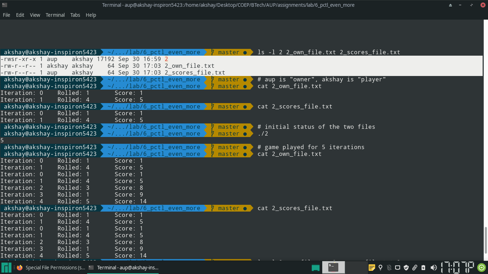
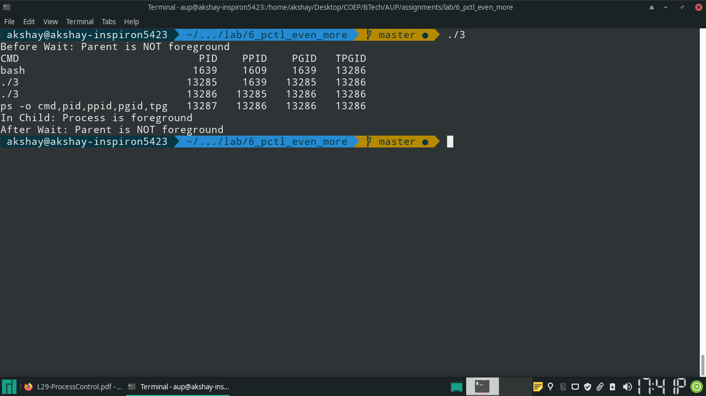

### Q1
> Implement the C program in which main program accepts an integer array. Parent
> creates two child processes. Parent process sorts the integer array and passes
> the sorted array to child process through the command line arguments of an exec
> call. The first child process uses this sorted array to display in ascending
> order and becomes a zombie process. The second child process uses this sorted
> array to display in descending  order and becomes an orphan process.

## Parent
\small

```{.c .numberLines  startFrom="1"}

#include <sys/types.h>
#include <unistd.h>
#include <string.h>
#include <stdlib.h>
#include <stdint.h>
#include <stdio.h>
#include <errno.h>

#define ZOMBIE 1
#define ORPHAN 2

#define BUFSIZE 100
#define MAXLEN 12
#define N 100
#define MOD 1000

static int32_t buf[BUFSIZE];
static int32_t arr[BUFSIZE];

/* merges a[left:mid], a[mid:right], using temp */
void merge(int32_t *a, int32_t left, int32_t right, int32_t *buf) {
		int32_t mid;
		int32_t size = left;
		int32_t lp, rp;

		mid = (left + right) / 2;

		lp = left;
		rp = mid;

		while (lp < mid && rp < right) {
				if (a[lp] <= a[rp]) {
						buf[size++] = a[lp++];
				}
				else {
						buf[size++] = a[rp++];
				}
		}

		int32_t start, end;
		if (lp == mid) {
				start = rp;
				end = right;
		}
		else {
				start = lp;
				end = mid;
		}

		while (start < end) {
				buf[size++] = a[start++];
		}


		memcpy(a + left, buf + left, sizeof(int32_t) * (right - left));
}


void mergesort_serial(int32_t *a, int32_t left, int32_t right, int32_t *buf) {
		int32_t mid = (left + right) / 2;

		if ((right - left) <= 1) {
				/* already sorted */
				return;
		}

		mergesort_serial(a, left, mid, buf);
		mergesort_serial(a, mid, right, buf);
		merge(a, left, right, buf);

		return;
}

void print_arr(int32_t *arr, int32_t n) {
		int32_t i;
		for (i = 0; i < n; i++) {
				printf("%d ", arr[i]);
		}
		printf("\n");
}

void read_array(int32_t *arr, int32_t n) {
		int32_t i;
		for (i = 0; i < n; i++) {
				arr[i] = 0;
				scanf("%d", &arr[i]);
		}
}


int32_t main(int32_t argc, char *argv[]) {

		extern char **environ;

		int32_t n, i;

		scanf("%d", &n);

		read_array(arr, n);

		mergesort_serial(arr, 0, n, buf);

		char **sorted_array = (char **)malloc(sizeof(char *) * (n + 1));
		if (!sorted_array) {
				fprintf(stderr, "unable to allocate sufficient memory\n");
				return 1;
		}
		for (i = 0; i < n; i++) {
				sorted_array[i] = (char *)malloc(sizeof(char) * MAXLEN);
				if (!sorted_array[i]) {
						fprintf(stderr, "malloc failed while allocating string\n");
				}
				sprintf(sorted_array[i], "%d", arr[i]);
		}
		sorted_array[n] = NULL;

		/* this trickery works because the size of int32_t is 4 bytes
		 * and the (char *) pointers of argv will either be 4 byte or 
		 * 8 byte (on 32 and 64 bit machines respectively, never less */

		if (!fork()) {
				/* first child */
				execve("./1_child1", sorted_array, environ);
		}
		
		sleep(5);
		printf("First child Zombied\n");
		system("ps -o pid,ppid,stat,comm");

		if (!fork()) {
				/* second child */
				execve("./1_child2", sorted_array, environ);
		}
		
		/* for first child to truly become zombie, the parent should remain in
		 * while loop forever to ensure that child exits first.
		 * However, we also want the second child to become an orphan, which
		 * means that the parent needs to exit.
		 * HENCE, sleep() calls have been inserted appropriately so that the
		 * 1. first child exists first (thus becoming a zombie for some time)
		 * 2. Then, the parent exits  (sleeps for 5)
		 * 3. Finally, the second thild exits (sleeps for 10)
		 * 
		 * A while loop will not be an appropriate solution here
		 * The parent is not going to reap either of the children 
		 * */

}

```

\normalsize

## First Child

\small

```{.c .numberLines startFrom="1"}

#include <stdio.h>

/* Child 1: prints array in ascending order and exits, becoming zombie */
int main(int argc, char *argv[]) {
		int i;
		printf("\nIn First Child\n");
		for (i = 0; i < argc; i++) {
				printf("%s ", argv[i]);
		}
		return 0;
}

```

\normalsize

## Second Child

\small

```{.c .numberLines startFrom="1"}


#include <unistd.h>
#include <stdlib.h>
#include <stdio.h>

/* Child 2: prints array in descending order and exits after parent becoming
orphan*/
int main(int argc, char *argv[]) {
		int i;

		printf("\nIn Child 2\n");

		for (i = argc - 1; i > -1; i--) {
				printf("%s ", argv[i]);
		}

		fflush(stdout);

		sleep(5);

		system("ps -o pid,ppid,stat,comm");

		printf("Second child became orphan\n");
}

```

\normalsize

## Output


\pagebreak


### Q2
> Create a game program that switches between the effective user ID and real user
> ID. The game player may write details (like game iteration number) to a file
> owned by the game player and manipulates a scores file that should be writable
> only by the game program owner. Both the game program and scores file are owned
> by the game program owner. Demonstrate that the game player can switch between
> the files in turns as own file, scores file, own file and scores file.


\small

```{.c .numberLines startFrom="1"}

#include <sys/types.h>
#include <sys/stat.h>
#include <fcntl.h>
#include <unistd.h>
#include <string.h>
#include <stdlib.h>
#include <stdint.h>
#include <stdio.h>
#include <errno.h>
#include <stdio.h>

#define OWN_FILE "2_own_file.txt"
#define SCORES_FILE "2_scores_file.txt"

#define BUFSIZE 100

int dice(int n) {
		return rand() % n;
}

static char buf[BUFSIZE];

int main(void) {

		/* On exec:
		 * RUID   EUID  SSUID
		 * player owner owner */

		int n, i, score, roll, chars_printed;
		int fp_own, fp_scores;
		uid_t player, owner;

		/* program knows that it has owner perms due to sticky bit */

		player = getuid(); /* player is real user id */

		owner = geteuid(); /* owner is effective user id */

		scanf("%d", &n);

		score = 0;

		for (i = 0; i < n; i++) {

				roll = dice(6);

				score += roll;

				chars_printed = sprintf(buf, "Iteration: %d\tRolled: %d\tScore: %d\n", i, roll, score);

				/* when entering loop:
				 * RUID   EUID  SSUID
				 * player owner owner */

				if ((fp_scores = open(SCORES_FILE, O_APPEND | O_WRONLY, S_IRUSR | S_IWUSR)) == -1) {
						perror(SCORES_FILE);
						return errno;
				}

				if (write(fp_scores, buf, chars_printed) != chars_printed) {
						perror("writing score to scores file");
						return errno;
				}

				if (setuid(player) == -1) {
						perror("switching to player");
						return errno;
				}

				/* now
				 * RUID		EUID	SSUID
				 * player	player	owner */

				if ((fp_own = open(OWN_FILE, O_APPEND | O_WRONLY, S_IRUSR | S_IWUSR)) == -1) {
						perror(OWN_FILE);
						return errno;
				}

				if (write(fp_own, buf, chars_printed) != chars_printed) {
						perror("writings score to player file");
						return errno;
				}

				if (setuid(owner) == -1) {
						perror("switching to owner");
						return errno;
				}

				/* now
				 * RUID		EUID	SSUID
				 * player	owner	player*/
		}
}
```
\normalsize

### Output

{ width=100% }

\pagebreak

### Q3
Write a program to do the following:

	1. Create a child
	2. let the child
		1. Create it’s own foreground process group.
		2. Call “ps” and verify the above
		3. Verify whether the process has controlling terminal
	3. Let the parent
		1. Shift the child to it’s own foreground process group.
		2. Check whether the process is in back ground or foreground and has controlling terminal.
		3. Wait for the child to terminate
		4. Check whether the process is in back ground or foreground.
	


```{.c .numberLines startFrom="1"}


#define _DEFAULT_SOURCE

#include <sys/types.h>
#include <unistd.h>
#include <sys/wait.h>
#include <string.h>
#include <stdlib.h>
#include <stdint.h>
#include <stdio.h>
#include <errno.h>
#include <stdio.h>

int is_process_foreground(void) {

		int p_pgrp, fg_pgrp;

		if ((p_pgrp = getpgrp()) == -1) {
				perror("parent getpgrp");
				return errno;
		}

		if ((fg_pgrp = tcgetpgrp(STDIN_FILENO)) == -1) {
				perror("parent tcgetpgrp");
				return errno;
		}

		if (fg_pgrp == p_pgrp) {
				return 1;
		}
		else {
				return 0;
		}

}


int main(void) {

		int cpid;
		int status;

		if ((cpid = fork())) {
				/* parent */
				if (setpgid(cpid, 0) == -1) {
						perror("setpgid in parent");
						return errno;
				}

				if (tcsetpgrp(STDIN_FILENO, cpid) == -1) {
						perror("tcsetpgrp in parent");
						return errno;
				}

				if (is_process_foreground()) {
						printf("Before Wait: Parent is foreground\n");
				}
				else {
						printf("Before Wait: Parent is NOT foreground\n");
				}

				if (wait(&status) == -1) {
						perror("wait");
						return errno;
				}

				if (is_process_foreground()) {
						printf("After Wait: Parent is foreground\n");
				}
				else {
						printf("After Wait: Parent is NOT foreground\n");
				}
		}
		else {
				/* child */


				if (setpgid(0, 0) == -1) {
						perror("setpgid in child");
						return errno;
				}


				if (tcsetpgrp(STDIN_FILENO, getpgid(0)) == -1) {
						perror("tcsetpgrp in parent");
						return errno;
				}

				if (system("ps -o cmd,pid,ppid,pgid,tpgid") == -1) {
						perror("ps");
						return errno;
				}

				if (is_process_foreground()) {
						printf("In Child: Process is foreground\n");
				}
				else {
						printf("In Child: Process is NOT foreground\n");
				}
		}
}
```
\normalsize

### Output

{ width=100% }
