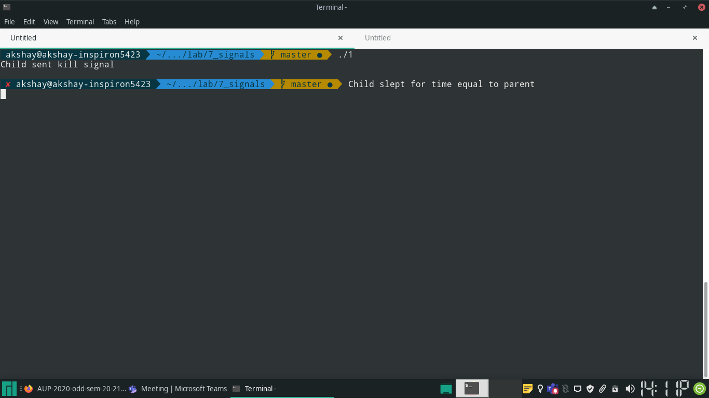
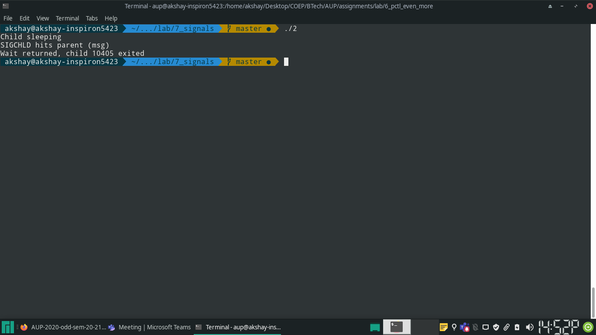
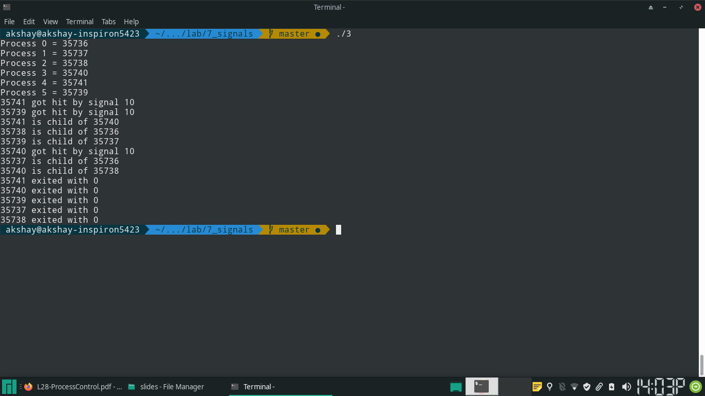

### Q1  Create a child process. Let the parent sleeps of 5 seconds and exits. Can the child send SIGINT to its parent if exists and kill it? Verify with a sample program.

## Code

\small

```{.c .numberLines startFrom="1"}


#include <sys/types.h>
#include <unistd.h>
#include <signal.h>
#include <stdlib.h>
#include <stdio.h>
#include <errno.h>

int main(void) {
		int child_pid;

		if ((child_pid = fork()) == -1) {
				/* fork failed */
				perror("fork");
				return errno;
		}
		else if (child_pid) {
				/* parent */
				sleep(5);
				printf("Parent is Alive\n");
		}
		else {
				/* child */
				if (kill(getppid(), SIGINT) == -1) {
						perror("SIGINT to parent");
						return errno;
				}
				printf("Child sent kill signal\n");
				sleep(5);
				printf("Child slept for time equal to parent\n");
		}
		
		return 0;
}

```

\normalsize

## Output



\pagebreak

## Q2: 

	Create a signal disposition to catch SIGCHLD and in the handler function display
	some message. Create a child process and let the child sleeps for some time and
	exits. The parent calls a wait() for the child. Display the return value of
	wait() to check success or failure. If failure, display the error number. Run
	the program:
	
	    a. Normal way executing in the foreground
	
	    b. Run as a back ground process and send SIGCHLD to it from the shell

## Code

\small

```{.c .numberLines startFrom="1"}


#include <sys/types.h>
#include <sys/wait.h>
#include <unistd.h>
#include <signal.h>
#include <errno.h>
#include <stdio.h>

void print_sigchld_msg(int sig_number) {
		printf("SIGCHLD hits parent (msg)\n");
}

int main(void) {
		pid_t child_id;

		int dead_child;
		int status;

		/* set handler for SIGCHLD */
		signal(SIGCHLD, print_sigchld_msg);

		if ((child_id = fork()) == -1) {
				perror("fork");
				return errno;
		}
		else if (child_id) {
				/* parent */

				if ((dead_child = wait(&status)) == -1) {
						perror("wait failed");
						return errno;
				}
				else {
						printf("Wait returned, child %d exited\n", dead_child);
				}
		}
		else {
				/* Child */
				printf("Child sleeping\n");
				sleep(10);
		}

		return 0;
}
				
```

\normalsize

## Output




\pagebreak

## Q3 You have to create a process tree as shown below. Then you let the parent process create a process group of (3, 4, 5) so that it sends a signal to this group. Print appropriate messages.

- 1 and 2 are children of 0
- 5 is child of 1
- 3 is child of 2
- 4 is child of 3

## Code

\small

```{.c .numberLines startFrom="1"}

#include <sys/types.h>
#include <sys/mman.h>
#include <sys/stat.h>
#include <sys/wait.h>
#include <unistd.h>
#include <fcntl.h>
#include <semaphore.h>
#include <signal.h>
#include <stdio.h>
#include <stdlib.h>
#include <errno.h>

#define SHARED_ARR "shared_array"
#define SEMAPHORE_FORKING "fork_semaphore"
#define N 6

/* to ensure that fp can be used by all processes */
static int fp;

void print_message(int signo) {
		printf("%d got hit by signal %d\n", getpid(), signo);
}

void examine_child(int pid) {
	int status;

	if (waitpid(pid, &status, 0) == -1) {
			perror("wait");
			exit(errno);
	}

	if (WIFEXITED(status)) {
			printf("%d exited with %d\n", pid, WEXITSTATUS(status));
	}
	else if (WIFSIGNALED(status)) {
			printf("%d killed by signal %d\n", pid, WTERMSIG(status));
	}
	else {
			printf("%d died in some other way\n", pid);
	}
}

void *get_shared_arr() {
		void *buf;
		/* asssert: fp is a file descriptor which points to the shared memory,
		 * and is inherited by all processes */
		if ((buf = mmap(NULL, sizeof(int) * N, PROT_READ | PROT_WRITE, MAP_SHARED, fp, 0)) == MAP_FAILED) {
				perror("shared memory mmap() failed");
				exit(errno);
		}
		return buf;
}


int main(void) {

		/* process 0 */
		/* can see the pids of {1, 2} */
		sem_t *fork_sem, *pgid_sem, *exit_sem;
		int *child_pid;
		int ret;

		if (signal(SIGUSR1, print_message) == SIG_ERR) {
				perror("SIGUSR1");
				return errno;
		}

		/* link shared memory address to process- this will be visible in
		 * children */
		if ((child_pid= mmap(NULL, sizeof(int) * N, 
										PROT_READ | PROT_WRITE, 
										MAP_SHARED | MAP_ANONYMOUS, 
										-1, 0)) == MAP_FAILED) {

				perror("mmap");
				return errno;
		}

		/* create a shared memory map for semaphore */
		if ((fork_sem = mmap(NULL, sizeof(sem_t), 
										PROT_READ | PROT_WRITE, 
										MAP_SHARED | MAP_ANONYMOUS, 
										-1, 0)) == MAP_FAILED) {

				perror("semaphore");
				return errno;
		}
		/* initialize semaphore with initial value 0- when 5 and 3 get
		 * created, this is incremented by 1 each. 0 will synchronize by calling
		 * down() on this twice */
		if (sem_init(fork_sem, 1, 0) == -1) {
				perror("semaphore initialization");
				return errno;
		}

		/* create a shared memory map for semaphore */
		if ((exit_sem = mmap(NULL, sizeof(sem_t), 
										PROT_READ | PROT_WRITE, 
										MAP_SHARED | MAP_ANONYMOUS, 
										-1, 0)) == MAP_FAILED) {

				perror("semaphore");
				return errno;
		}

		/* initialize semaphore with initial value 0- when signals have been
		 * sent, this will be incremented 5 times, wherin all processes will
		 * exit */
		if (sem_init(exit_sem, 1, 0) == -1) {
				perror("semaphore initialization");
				return errno;
		}

		/* create a shared memory map for semaphore */
		if ((pgid_sem = mmap(NULL, sizeof(sem_t), 
										PROT_READ | PROT_WRITE, 
										MAP_SHARED | MAP_ANONYMOUS, 
										-1, 0)) == MAP_FAILED) {

				perror("semaphore");
				return errno;
		}

		/* initialize semaphore with initial value 0- when all processes have
		 * called setpgid, the parent can send signals */
		if (sem_init(pgid_sem, 1, 0) == -1) {
				perror("semaphore initialization");
				return errno;
		}

		/* assert: now each child will have access to the semaphore, unless the
		 * memory region is purposely unliked */


		if ((ret = fork()) == -1) {
				perror("fork 1");
				return errno;
		}
		else if (!ret) {
				/* child 1 */
				/* can see pids of {5} */
				/* child_pid = (int *)get_shared_arr(); */

				if ((ret = fork()) == -1) {
						perror("fork 5");
						return errno;
				}
				else if (!ret) {
						/* chlid 5 */
						/* can see pids of {} */
						/* child_pid = (int *)get_shared_arr(); */

						/* wait for the PID of 3 to be available */
						if (sem_wait(fork_sem) == -1) {
								perror("P operation in 5");
						}

						/* set own process group to 3 */
						if (setpgid(0, child_pid[3]) == -1) {
								perror("setpgid(5, 3)");
								return errno;
						}
				
						if (sem_post(pgid_sem) == -1) {
								perror("setpgid(5, 3) done synchronization");
								return errno;
						}


						/* wait for 0 to allow exiting */
						if (sem_wait(exit_sem) == -1) {
								perror("V operation in 4");
								return errno;
						}

						printf("%d is child of %d\n", getpid(), getppid());

						return 0;
				}
				child_pid[5] = ret;


				/* wait for 0 to allow exiting */
				if (sem_wait(exit_sem) == -1) {
						perror("V operation in 2");
						return errno;
				}

				printf("%d is child of %d\n", getpid(), getppid());

				examine_child(child_pid[5]);

				return 0;
		}
		child_pid[1] = ret;

		if ((ret = fork()) == -1) {
				perror("fork 2");
				return errno;
		}
		else if (!ret) {
				/* child 2 */
				/* can see pids of {3} */
				/* child_pid = (int *)get_shared_arr(); */

				if ((ret = fork()) == -1) {
						perror("fork 3");
						return errno;
				}
				else if (!ret) {
						/* child 3*/
						/* can see pids of {4} */

						child_pid[3] = getpid();

						if (setpgid(child_pid[3], child_pid[3]) == -1) {
								perror("setpgid(3, 3");
								return errno;
						}

						if (sem_post(pgid_sem) == -1) {
								perror("setpgid(3, 3) done synchronization");
								return errno;
						}

						/* tell 5  that pid of 3 is available in shared memory,
						 * and it can call setpgid safely*/
						if (sem_post(fork_sem) == -1) {
								perror("P operation in 3");
								return errno;
						}


						if ((ret = fork()) == -1) {
								perror("fork 4");
								return errno;
						}
						else if (!ret) {
								/* child 4*/
								/* can see pids of {} */
								/* child_pid = (int *)get_shared_arr(); */

								if (setpgid(0, child_pid[3]) == -1) {
										perror("setpgid(4, 3)");
										return errno;
								}

								/* tell 0 that 4 has moved to new process group
								 * */
								if (sem_post(pgid_sem) == -1) {
										perror("setpgid(4, 3) done synchronization");
										return errno;
								}


								/* wait for 0 to allow exiting */
								if (sem_wait(exit_sem) == -1) {
										perror("V operation in 4");
										return errno;
								}

								printf("%d is child of %d\n", getpid(), getppid());

								return 0;

						}

						child_pid[4] = ret;


						if (sem_wait(exit_sem) == -1) {
								perror("V operation in 3");
								return errno;
						}

						printf("%d is child of %d\n", getpid(), getppid());

						examine_child(child_pid[4]);

						return 0;
				}
				child_pid[3] = ret;


				/* wait for 0 to allow exiting */
				if (sem_wait(exit_sem) == -1) {
						perror("V operation in 2");
						return errno;
				}

				printf("%d is child of %d\n", getpid(), getppid());

				examine_child(child_pid[3]);

				return 0;
		}
		child_pid[2] = ret;

		/* wait till all processes created, and the 3 setpgid calls finish */
		int i;
		for (i = 0; i < 3; i++) {
				if (sem_wait(pgid_sem) == -1) {
						perror("V operation in 0");
						return errno;
				}
		}

		child_pid[0] = getpid();

		if (kill(-child_pid[3], SIGUSR1) == -1) {
				perror("kill");
				return errno;
		}

		for (i = 0; i <= 5; i++) {
				printf("Process %d = %d\n", i, child_pid[i]);
		}


		for (i = 0; i < 5; i++) {
				if (sem_post(exit_sem) == -1) {
						perror("P by 0");
						return errno;
				}
		}

		examine_child(child_pid[1]);
		examine_child(child_pid[2]);

		return 0;

}

```

\normalsize

### Explanation
- Shared memory is created for sharing pids and semaphores
- 3 semaphores are used
- *fork_sem* is used by process 3 to tell process 5 that it's pid is available in
  shared memory, and that it's process group has been created
- *pgid_sem* is used for telling 0 that all 3 setpgid calls are done
- *exit_sem* is used for telling 1-5 that it has called kill, and they are free
  to exit now


## Output


