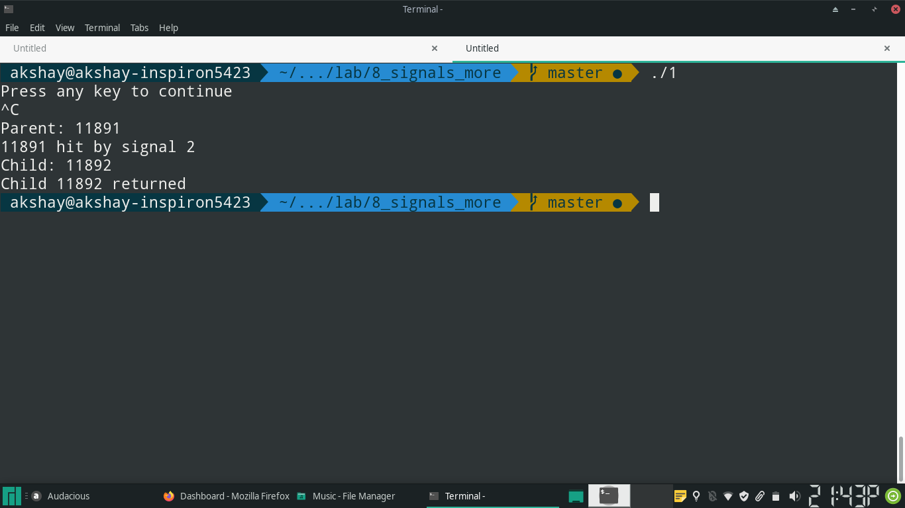
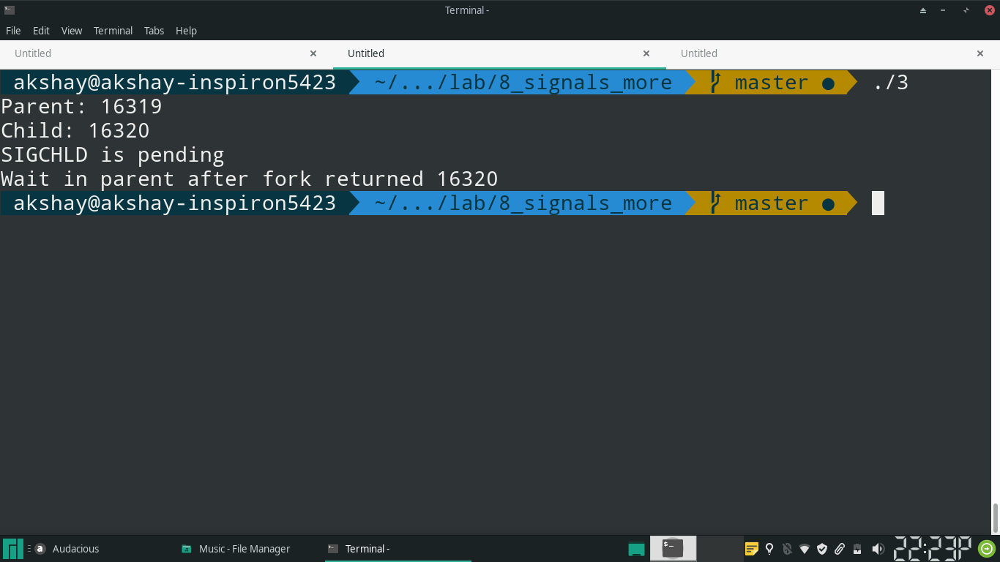

---
title: "AUP Assignment 7"
author: 111703013 Akshay Rajesh Deodhar
date: "11th October 2020"
header-includes:
- \usepackage{setspace}
geometry: margin=2.5cm
---

## Q1 
“Child inherit parent’s signal mask when it is created, but pending signals
for the parent process are not passed on”. Write appropriate program and
test with suitable inputs to verify this

## Code
\small
```{.c .numberLines startFrom="1"}

#include <sys/types.h>
#include <unistd.h>
#include <signal.h>
#include <errno.h>
#include <stdio.h>
#include <wait.h>

void print_message(int signo) {
		printf("%d hit by signal %d\n", getpid(), signo);
}


int main(void) {
		struct sigaction sigint_handler;
		sigset_t old, new;

		sigint_handler.sa_handler = print_message;
		sigemptyset(&(sigint_handler.sa_mask));

		/* read current mask */
		if (sigprocmask(0, NULL, &new) == -1) {
				perror("sigprocmask- read");
				return errno;
		}

		if (sigaction(SIGINT, &sigint_handler, NULL) == -1) {
				perror("sigaction");
				return errno;
		}

		if (signal(SIGINT, print_message) == SIG_ERR) {
				perror("signal");
				return errno;
		}

		/* block SIGINT */
		if (sigaddset(&new, SIGINT) == -1) {
				perror("sigaddset");
				return errno;
		}

		if (sigprocmask(SIG_BLOCK, &new, &old) == -1) {
				perror("sigprocmask- modify");
				return errno;
		}

		printf("Press any key to continue\n");

		getchar();

		int child_pid, status, wait_ret;
		if ((child_pid = fork()) == -1) {
				perror("fork");
				return errno;
		}
		else if (child_pid) {
				/* parent */
				/* stop blocking SIGINT */
				printf("Parent: %d\n", getpid());
				if (sigprocmask(SIG_SETMASK, &old, NULL) == -1) {
						perror("sigprocmask- reset old, parent");
						return errno;
				}

				if ((wait_ret = wait(&status)) == -1) {
						perror("wait");
						return errno;
				}

				printf("Child %d returned\n", wait_ret);

		}
		else {
				/* child */
				printf("Child: %d\n", getpid());
				/* stop blocking SIGINT */
				if (sigprocmask(SIG_SETMASK, &old, NULL) == -1) {
						perror("sigprocmask- reset old, child");
						return errno;
				}
		}
		
		return 0;
}
```
\normalsize

## Output




## Explanation
- SIGINT is blocked in parent, and a handler for SIGINT is set.
- During execution, send SIGINT to parent from terminal before it forks. This
  means that SIGINT is not pending.
- After forking, SIGINT is unblocked.
- It is observed that SIGINT hits only the parent, and not the child.

\pagebreak

## Q2
Write a program to understand the proper functioning of SIGCHLD and wait
() synchronization. Create a signal handler for SIGCHILD and in the
handler, call wait. In the handler, keep a message before wait and
another message for the success or failure of wait. In the main
function, fork and let the parent wait for the child.  In the main
function, keep a message before wait and another message for the success
or failure of wait. Elaborate your understanding about which wait
collects the termination status of the child. What is the sequence of
execution of wait and signal handler?

```{.c .numberLines startFrom="1"}

#include <sys/types.h>
#include <unistd.h>
#include <signal.h>
#include <errno.h>
#include <stdio.h>
#include <wait.h>

void reaper(int signo) {
		int status, wait_ret;
		printf("Waiting in signal handler\n");
		if ((wait_ret = wait(&status)) == -1) {
				printf("Wait in signal handler failed\n");
		}
		else {
				printf("Wait in signal handler returned %d\n", wait_ret);
		}
}


int main(void) {
		struct sigaction sigint_handler;

		sigint_handler.sa_handler = reaper;
		sigemptyset(&(sigint_handler.sa_mask));

		if (sigaction(SIGCHLD, &sigint_handler, NULL) == -1) {
				perror("sigaction");
				return errno;
		}

		int child_pid, status, wait_ret;
		if ((child_pid = fork()) == -1) {
				perror("fork");
				return errno;
		}
		else if (child_pid) {
				/* parent */
				printf("Parent: %d\n", getpid());
				printf("Waiting in parent, after fork\n");
				if ((wait_ret = wait(&status)) == -1) {
						printf("Wait in parent after fork failed\n");
				}
				else {
						printf("Wait in parent after fork returned %d\n", wait_ret);
				}

		}
		else {
				/* child */
				printf("Child: %d\n", getpid());
				return 0;
		}
		
		return 0;
}
```
\normalsize

## Output


## Explanation
- The wait() called after fork collects the termination status of the child.
- If wait() is blocking before the child exits, then the wait returns first.
  Immediately after wait() returns, SIGCHLD hits and it's handler runs. 
- Because the child has already been reaped, the wait() inside the handler
  fails.

\pagebreak

## Q3 
Write a program to understand the proper functioning of blocked
SIGCHLD and wait(). In the main function, block SIGCHLD and fork().
Let the child exits immediately and parent sleep(5), display the
pending signals and wait for the child.  Is there any need for
SIGCHLD to be delivered for the wait() to return?  Elaborate your
understanding.

## Code

\small
```{.c .numberLines startFrom="1"}

#include <sys/types.h>
#include <unistd.h>
#include <signal.h>
#include <errno.h>
#include <stdio.h>
#include <wait.h>

int main(void) {

		sigset_t mask, pending;

	    /* block SIGCHLD*/
		if (sigaddset(&mask, SIGCHLD) == -1) {
				perror("sigaddset");
				return errno;
		}

		if (sigprocmask(SIG_BLOCK, &mask, NULL) == -1) {
				perror("sigprocmask- modify");
				return errno;
		}

		int child_pid, status, wait_ret;
		if ((child_pid = fork()) == -1) {
				perror("fork");
				return errno;
		}
		else if (child_pid) {
				/* parent */
				printf("Parent: %d\n", getpid());

				sleep(5);

				if (sigpending(&pending) == -1) {
						perror("sigpending");
						return errno;
				}

				int is_member;
				if ((is_member = sigismember(&pending, SIGCHLD)) == -1) {
						perror("sigismember");
						return errno;
				}
				else if (is_member) {
						printf("SIGCHLD is pending\n");
				}
				else {
						printf("SIGCHLD is not pending\n");
				}

				if ((wait_ret = wait(&status)) == -1) {
						printf("Wait in parent after fork failed\n");
				}
				else {
						printf("Wait in parent after fork returned %d\n", wait_ret);
				}

		}
		else {
				/* child */
				printf("Child: %d\n", getpid());
				return 0;
		}
		
		return 0;
}
```
\normalsize

## Output



## Explanation
- SIGCHLD remains pending when wait returns. So we can conclude that wait()
  returns when child exits, not when SIGCHLD is delivered.
- SIGCHLD does not need to be delivered for wait() to return.
