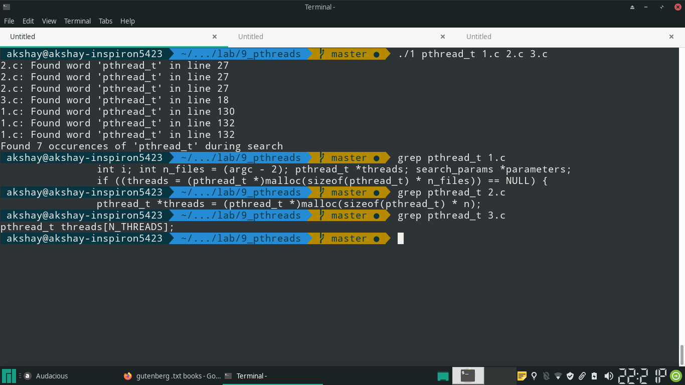

## Q1 
Write a program to take input from user for number of files to be scanned and
word to be searched. Write a multi threaded program to search the files and
return pattern if found.

## Code
\small
```{.c .numberLines startFrom="1"}

#include <sys/types.h>
#include <unistd.h>
#include <fcntl.h>
#include <pthread.h>
#include <errno.h>
#include <stdio.h>
#include <stdlib.h>
#include <string.h>
#include <ctype.h>


#define BUF_SIZE 1024
typedef struct {
		int fp;
		int offset;
		int chars_read;
		char buf[BUF_SIZE];
}read_buf;

void get_read_buf(read_buf *b, int fp) {
		b->fp = fp;
		b->offset = 0;
		b->chars_read = -1;
}

void destroy_read_buf(read_buf *b) {
		close(b->fp);
		b->offset = b->fp = 0;
		b->chars_read = -1;
}

int getchar_buffered(read_buf *b) {
		if (b->chars_read < 0 || b->offset == b->chars_read) {
				if ((b->chars_read = read(b->fp, b->buf, BUF_SIZE)) == -1) {
						perror("read");
						exit(errno);
				}

				if (!b->chars_read) {
						/* this is the end of file */
						return EOF;
				}

				/* assert: buffer has nonzero number of bytes */
				b->offset = 0;
		}

		return b->buf[++(b->offset)];
}

typedef struct {
		char *filepath;
		char *word;
		int count;
}search_params;


#define MAX_WORD 512 
#define IN 101
#define OUT 102
void *search_word(void *arg) {
		search_params *sp;
		sp = (search_params *)arg;

		int c;
		int fp;
		read_buf rb;

		int lineno = 1;

		int state = OUT;
		char word[MAX_WORD + 1];
		int wordlen = 0;

		if ((fp = open(sp->filepath, O_RDONLY)) == -1) {
				perror("open");
				exit(errno);
		}

		get_read_buf(&rb, fp);

		while ((c = getchar_buffered(&rb)) != EOF) {
				if (c == '\n') {
						lineno++;
				}

				if (state == OUT) {
						if (isalpha(c) || c == '_') {
								state = IN;
								wordlen = 0;
								word[wordlen++] = c;
						}
				}
				else if (state == IN) {
						if (!(isalpha(c) || (c == '_'))) {
								word[wordlen] = '\0';
								state = OUT;
								wordlen = 0;
								/* printf("%s\n", word); */
								if (strcmp(word, sp->word) == 0) {
										/* word found */
										printf("%s: Found word '%s' in line %d\n", sp->filepath, sp->word, lineno);
										++sp->count;
								}
						}
						else {
								word[wordlen++] = c;
						}
				}
				else {
						fprintf(stderr, "Invalid State\n");
						exit(1);
				}
		}

		destroy_read_buf(&rb);

		/* pthread_exit(NULL); */
		return &(sp->count);
}

int main(int argc, char *argv[]) {

		/* search word file1 file2 .. */
		if (argc < 3) {
				fprintf(stderr, "usage: ./search <word> <file1> [<file2> ... <file-n>]\n");
				return EINVAL;
		}

		int i; int n_files = (argc - 2); pthread_t *threads; search_params *parameters;

		if ((threads = (pthread_t *)malloc(sizeof(pthread_t) * n_files)) == NULL) {
				fprintf(stderr, "malloc failed\n");
				return 1;
		}

		if ((parameters = (search_params *)malloc(sizeof(search_params) * n_files)) == NULL) {
				fprintf(stderr, "malloc failed\n");
				return 1;
		}

		for (i = 0; i < n_files; i++) {

			/* add file path to parameters */
			if ((parameters[i].filepath = (char *)malloc(sizeof(char) * (strlen(argv[2]) + 1))) == NULL) {
					fprintf(stderr, "malloc failed\n");
					return 1;
			}
			strcpy(parameters[i].filepath, argv[2 + i]);

			/* add search pattern to parameters */
			if ((parameters[i].word = (char *)malloc(sizeof(char) * (strlen(argv[1]) + 1))) == NULL) {
					fprintf(stderr, "malloc failed\n");
					return 1;
			}
			strcpy(parameters[i].word, argv[1]);

			/* initialize count to 0 */
			parameters[i].count = 0;

			/* dispatch thread for searching file */
			pthread_create(&threads[i],
						   NULL,
						   search_word,
						   (void *)&parameters[i]);
		}

		int total_count = 0;

		for (i = 0; i < n_files; i++) {
				if (pthread_join(threads[i], NULL)) {
						fprintf(stderr, "Unable to join thread\n");
				}
				free(parameters[i].word);
				free(parameters[i].filepath);

				total_count += parameters[i].count;
		}

		printf("Found %d occurences of '%s' during search\n", total_count, argv[1]);
		
		return 0;
}
```
\normalsize

## Output



\pagebreak

## Q2
Write a program to find number of CPUs, create that many threads and attach those threads to CPUs

## Code
```{.c .numberLines startFrom="1"}

#define _GNU_SOURCE
#include <sched.h>
#include <sys/sysinfo.h>
#include <unistd.h>
#include <pthread.h>
#include <stdio.h>
#include <errno.h>
#include <stdlib.h>

void *busy_void(void *arg) {
		int count = 100000;
		while (count--);
		return NULL;
}

int main(void) {
		
		int n;

		if ((n = sysconf(_SC_NPROCESSORS_CONF)) == -1) {
				perror("sysconf");
				return errno;
		}

		printf("Number of CPUs: %d\n", n);

		pthread_t *threads = (pthread_t *)malloc(sizeof(pthread_t) * n);
		cpu_set_t *cpus = (cpu_set_t *)malloc(sizeof(cpu_set_t) * n);

		int i;
		for (i = 0; i < n; i++) {
				CPU_ZERO(&cpus[i]);
				CPU_SET(i, &cpus[i]);
		}

		for (i = 0; i < n; i++) {
				if (pthread_create(&threads[i], 
								   NULL,
								   busy_void,
								   NULL) == -1) {
						fprintf(stderr, "Unable to create thread\n");
				}
		}

		/* DANGER: non-POSIX code */
		for (i = 0; i < n; i++) {
				if (pthread_setaffinity_np(threads[i],
										   sizeof(cpu_set_t),
										   &cpus[i]) == -1) {
						fprintf(stderr, "Unable to set affinity\n");
						return 1;
				}
		}

		for (i = 0; i < n; i++) {
				if (pthread_getaffinity_np(threads[i],
										   sizeof(cpu_set_t),
										   &cpus[i]) == -1) {
						fprintf(stderr, "Unable to get affinity\n");
						return 2;
				}
				printf("Thread %d is ", i);
				if (!CPU_ISSET(i, &cpus[i])) {
						printf("not ");
				}
				printf("attached to CPU %d\n", i);

				if (pthread_join(threads[i], NULL) == -1) {
						fprintf(stderr, "Unable to join with thread %lu\n", threads[i]);
				}

		}


		return 0;

}
```
\normalsize


\pagebreak

## Q3

Write a short program that creates 5 threads which print a thread "id" that is
passed to thread function by pointer.

## Code

\small
```{.c .numberLines startFrom="1"}


#define _GNU_SOURCE
#include <sched.h>
#include <sys/sysinfo.h>
#include <unistd.h>
#include <pthread.h>
#include <stdio.h>
#include <errno.h>
#include <stdlib.h>


void *busy_void(void *arg) {
		printf("This is thread %d\n", *((int *)arg));
		return NULL;
}

#define N_THREADS 5
static int thread_ids[N_THREADS];
pthread_t threads[N_THREADS];
int main(void) {
		
		int n, i;

		n = N_THREADS;

		for (i = 0; i < n; i++) {
				thread_ids[i] = i;
				if (pthread_create(&threads[i], 
								   NULL,
								   busy_void,
								   &thread_ids[i]) == -1) {
						fprintf(stderr, "Unable to create thread\n");
				}
		}
		for (i = 0; i < n; i++) {
				if (pthread_join(threads[i], NULL) == -1) {
						fprintf(stderr, "Unable to join with thread %lu\n", threads[i]);
				}
		}


		return 0;

}
```

## Output


